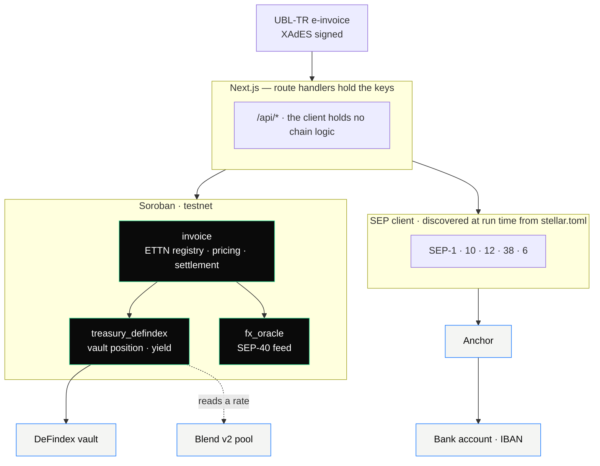

<picture>
  <source media="(prefers-color-scheme: dark)" srcset="public/brand/readme-dark.svg">
  
</picture>

[](https://payper.live)
[](https://payper.live)

<br>

**Working capital for suppliers, funded from anywhere.** A supplier waits
ninety days to be paid. The capital that could bridge that gap sits inside
domestic bank balance sheets, and a funder abroad has no way to reach it — no
local-currency account, no correspondent banking relationship, no ticket small
enough to be worth the paperwork. Payper opens that door: an e-invoice the buyer
has acknowledged on chain becomes an instrument anyone holding USDC can fund, in
seconds, from fifty dollars up. The supplier is paid the same day in their own
currency and never touches crypto; the funder is repaid in USDC and never opens
an account in the supplier's country.

The mechanism is the same wherever suppliers invoice on terms; what changes per
country is the document standard, the invoice identifier and the anchor. The
first corridor is Türkiye, and that is what runs on testnet today — every
country-specific detail below (ETTN, lira, the SEP-6 anchor) is that corridor's
instance of a general rule, marked where it appears.

Rise In x Stellar Pro Hackathon 2026 · Genesis Track · Stellar testnet · **4th place** · awarded prize funding · built by [cansarihan](https://github.com/cansarihan) and [berkcicekk](https://github.com/berkcicekk)

**Live:** [payper.live](https://payper.live) · **Contract:**
[`CB2EUFAF…3NBA`](https://stellar.expert/explorer/testnet/contract/CB2EUFAFCDKWHCYBHGDTFNOHJEVYH3WKTKL4OTGX5FUKP272GHQG3NBA)

---

## Evaluating this in five minutes

```bash
npm install
npm run build && npm start        # http://localhost:3000
npm run smoke                     # the whole flow against testnet
npm run test:contracts            # 29 contract tests
npm run test:ubl                  # document validator
npm run test:tranche              # anchor transfer splitter
npm run test:sep53                # signed messages, against the spec's vectors
npm run test:auth                 # login, from the attacker's side
npm run test:chirp                # the audio payment frame, 2000 random payloads
npm run test:wallet               # a wallet signs its own transaction (needs the app running)
npm run test:fresh                # a brand-new wallet, from empty to funded
npm run test:chain                # one wallet signs register, acknowledge, lock and fund
```

`npm run smoke` is the one to run. It registers an invoice, has the buyer
acknowledge it, reads a live price, funds it from two funders who buy USDC
through the anchor first, settles at maturity, distributes pro rata, and then
tries to register the same ETTN again — which the contract refuses. Every step
is a real transaction on testnet.

What to look for, in order:

| | Where | What it shows |
|---|---|---|
| 1 | `npm run smoke`, final step | The same ETTN is refused. This is the product's one invariant |
| 2 | `npm run smoke`, step 3 | Currency risk reports `live` — read from the feed, not configured. The yield component reports `fallback` and says why, which is the point: provenance is labelled, never assumed |
| 3 | Dashboard → Anchor | The SEP trace, request by request, with the status the anchor returned |
| 4 | [stellar.expert](https://stellar.expert/explorer/testnet/contract/CB2EUFAFCDKWHCYBHGDTFNOHJEVYH3WKTKL4OTGX5FUKP272GHQG3NBA) | The transactions the run just wrote |

Known limitations are in [Honest limitations](#honest-limitations), not buried.

---

## The problem

An SME issues an invoice with 60 to 120 days of terms. The goods have shipped
and the wages are paid, but the money arrives in three months. The gap is closed
by factoring: a bank or factor advances the cash and takes a discount. Every
economy with commercial credit terms runs some version of this, and the market
is large and established rather than speculative.

In the first corridor the numbers are public. Türkiye had **4,016,059 active
enterprises in 2025, of which 99.6% are SMEs** (TÜİK), and the factoring sector
turned over **1.875 trillion TRY across roughly 95,000 customers in 2025**,
mostly SMEs. This is not a market that needs convincing — it is one that already
pays.

What it does not have is a price anyone can check. The cost is quoted per deal
at a desk as interest plus commission plus local transaction tax (in Türkiye,
5% BSMV). There is no published rate and no reference to compare against.

But the binding constraint is not demand, it is supply. Factoring capital is
bank capital: a factor can advance only what its own balance sheet and its bank
lines allow, and those are bounded by the country it is licensed in. A funder
abroad who would happily take that risk at that price cannot reach it — not for
regulatory reasons alone, but because the plumbing does not exist below a ticket
size that makes correspondent banking, currency conversion and settlement worth
the cost.

Two further problems follow from how the market works:

1. **The discount is asserted, not derived.** The customer has no way to tell
   what part of the rate is the cost of money, what part is currency risk, and
   what part is margin.
2. **The same receivable can be sold twice.** The expensive fraud in factoring is
   financing one invoice at two institutions. Where a central registry exists it
   covers licensed members only (Türkiye's does); capital arriving from outside
   that perimeter cannot query it, and many corridors have no registry at all.

## What Payper does

**It opens the pool.** An acknowledged receivable becomes an instrument anyone
holding USDC can fund — in seconds, from fifty dollars, with no local-currency
account and no banking relationship in the supplier's country. That is the part
a database cannot do, and it is the reason this is built on Stellar rather than
on Postgres.

**One invoice identifier, one financing.** Every national e-invoice standard
carries a unique document identifier; in the first corridor that is the ETTN,
assigned per document on every Turkish e-invoice. Its hash is written to the
contract at registration, and a second registration is refused before anything
else happens — not by a database row, but by a contract invariant. This is
hygiene rather than the headline: a licensed factor inside a country with a
registry can already check it. A funder in Berlin cannot, and the contract gives
them the same guarantee without asking them to join anything.

**The price is computed, not quoted.** Four components, two of them read from
chain on every call:

| Component | Source | Provenance |
|---|---|---|
| Funding yield | Treasury APY, scaled to tenor. The DeFindex vault's own realised gain when it has one, otherwise what the reference Blend v2 pool has paid suppliers | **live** |
| Currency risk | Observed move in the local-currency feed (TRY/USD) | **live** |
| Credit premium | Parameter | configured |
| Platform fee | Parameter | configured |

Two of the four are read from chain on every call, so the total is not a figure
this page can state — it moves with the feed and with what the reference pool is
paying. Ask the contract instead:

```bash
stellar contract invoke --id CB2EUFAFCDKWHCYBHGDTFNOHJEVYH3WKTKL4OTGX5FUKP272GHQG3NBA --source payper-admin --network testnet -- quote --invoice_id 33
```

At the time of writing that returns 924 bps over 89 days — 31 for the yield, 723
for currency risk, 120 and 50 for the two parameters. Each component carries its
provenance, so a number that fell back to a parameter cannot be presented as
live, and a total quoted from memory cannot be presented as current.

The yield component has two chain sources, in order. First the DeFindex vault's
own realised gain. The vault carries no strategy on testnet — DeFindex's own
strategies are bound to their test USDC, while this system holds Circle's
testnet USDC because that is what the anchor issues — so there is nothing
realised there to measure. The adapter then reads a Blend v2 pool instead:
`b_rate`, the pool's bToken-to-underlying index, is sampled once when the
reference is set and the growth since that sample is annualised. The pool
accrues its reserve to the current ledger on every read, so the index is a
smooth function of time and ten minutes of it is enough to measure. That is the
rate this capital earns lending on Stellar, which is the cost of money the
discount is meant to carry. Neither source is a parameter, and when neither can
be read the adapter refuses rather than substituting a number that would arrive
wearing the live badge.

**The money reaches a bank account.** The supplier's USDC is sold for local
currency through a SEP-6 anchor and the buyer settles in the same currency at
maturity. Both directions run against a real anchor — lira in the first
corridor, any currency with a SEP-6 anchor after it.

## Who it is for

Suppliers invoicing a single large corporate buyer — organised retail,
automotive sub-industry, construction materials. Ticket sizes of roughly 1,500
to 15,000 USD equivalent (50,000 to 500,000 TRY in the first corridor) on 30 to
120 day terms.

The buyer's acknowledgement is the lock: it is what makes the receivable real to
a funder, and it is also the distribution channel. One corporate buyer brings
its suppliers with it.

## Architecture



The flow, end to end: a supplier uploads a signed e-invoice, the contract writes its ETTN and
refuses a second registration of the same one. The buyer acknowledges on chain. `quote()` reads
the treasury's yield and the currency feed and returns a discount with each component's
provenance. Funders contribute USDC, buying it through the anchor if they hold none. Once the
invoice fills, the treasury releases the payout and the supplier sells it for local currency through
the same anchor. At maturity the buyer repays and the contract distributes pro rata to whoever
holds the claim at that moment — which is not necessarily whoever funded it.

### Components

| Component | Responsibility |
|---|---|
| `contracts/invoice` | ETTN uniqueness, registration, acknowledgement, pricing, the quote lock, funding, transferable claims, settlement, default and recourse, whitelist, first-loss buffer |
| `contracts/treasury_defindex` | Treasury backed by a DeFindex vault; holds the position in vault shares and reports the vault's realised rate |
| `contracts/treasury_local` | The same adapter interface over plain USDC, so the product still runs if the vault is unreachable |
| `contracts/fx_oracle` | SEP-40 shaped local-currency feed (TRY/USD) for testnet |
| `src/lib/chirp.ts` | The audio payment frame: 16 tones, a 5-symbol preamble, CRC-8, and the SEP-7 URI the QR carries |
| `src/lib/chirpDecoder.ts` | The receiving half: microphone, FFT, preamble lock, slot sampling, CRC |
| `src/lib/bank.ts` | The payout destination, with the IBAN's own ISO 7064 checksum verified before anything is stored |
| `src/lib/ubl` | UBL-TR parsing, XAdES structural check, document hash |
| `src/lib/anchor` | SEP-1 discovery, SEP-10 auth, SEP-38 quotes, SEP-6 transfers, transfer splitting |
| `src/lib/soroban` | Contract reads and writes, i128 encoding, error attribution |
| `src/lib/auth` | Sessions, login challenges, SEP-53 verification |
| `src/lib/server/guard.ts` | Role-based access, operator gate, rate limiting |
| `src/app/api` | Route handlers — the only place keys are used |

### Stellar integrations

| | Where it is used |
|---|---|
| **Soroban** SDK 27.0.6, protocol 28 | Four contracts, `wasm32v1-none` |
| **DeFindex** | The treasury is a vault created through the DeFindex factory; contributions become vault shares and a payout burns them |
| **SEP-1** | Anchor discovery. Every endpoint is read at run time |
| **SEP-6** | Programmatic deposit and withdrawal, both directions |
| **SEP-10** | Challenge authentication, validated before signing |
| **SEP-12** | Customer registration |
| **SEP-38** | Firm quotes, so the payout shown is the payout paid |
| **SEP-7** | Payment URI in the QR, so any SEP-7 wallet can scan the same request the tones carry |
| **SEP-40** | Oracle interface implemented by `fx_oracle` |
| **SEP-41** | The treasury position is a SEP-41 token — the DeFindex vault share. Full interface: `transfer`, `transfer_from`, `approve`, `allowance`, `balance`, `burn`, `burn_from`, `name`, `symbol`, `decimals`, `total_supply` |
| **SEP-53** | Signed messages for wallet login |

The anchor integration is load-bearing rather than decorative. Without it the
supplier cannot be paid in their own currency and the buyer cannot settle, which is the
product's entire proposition. Without the treasury, `fund()` cannot complete and
the yield component of the price has no source.

---

## Design decisions and trade-offs

**SEP-6 rather than SEP-24.** The anchor implements SEP-6, and programmatic
transfer is the better fit regardless: the discount breakdown stays in our own
interface. A SEP-24 flow hosted by the anchor could not show it, and that
breakdown is the product. The trade-off is that KYC and the bank steps are ours
to drive.

**The treasury sits behind an adapter.** The invoice contract knows four
functions — `apy_bps`, `deposit`, `withdraw`, `total_assets` — and nothing about
what implements them. Two implementations exist: a DeFindex vault, which the
running deployment uses, and plain USDC as a fallback. Either can be swapped in
with one `set_config` call, and either can fail without the flow changing shape.
The trade-off is one layer of indirection and an extra cross-contract call per
quote.

**A vault with our own asset rather than a yielding one.** DeFindex's published
testnet vault is denominated in a different USDC to the one our anchor issues,
and the two are not interchangeable. Rather than re-denominate the product
around the vault — which would have left the anchor holding an asset it cannot
issue — we created our own vault through their factory against our USDC. The
integration is real in both directions: deposits become vault shares and a
payout burns them. The rate the price uses is read from a Blend v2 pool — what
USDC earns lending on Stellar — because that is a measured market rate rather
than a number we chose.

**Accepted quotes expire, and the ledger does it.** `accept_quote` fixes the
discount because funders subscribe against a fixed payout. The lock is written to
*temporary* storage with `quote_ttl` as its TTL, so it disappears without a sweep
or a timestamp anyone has to re-check. The window is 24 hours: sized to a funding
round filling from several funders, not to SEP-38's ten-minute rate validity.

**Currency risk is never priced at zero.** A quiet feed still pays the floor; a
collapsing one is capped. The fallback is expressed per annum and scaled to the
tenor, so a 30-day invoice is not charged what a 120-day one is.

**Recourse is deliberately simple.** On default the first-loss buffer is drained
to funders pro rata and the remainder is recorded as a claim on the seller. Risk
tranches and credit scoring were left out: there is no data to score with, and a
score produced without data is not honest. The credit premium is labelled a
parameter for the same reason.

**No chain logic in the client, but the signature is the caller's.** Reads and
the building of a call go through a route handler. A connected wallet signs its
own transactions: the server prepares and simulates the call and hands over an
unsigned envelope, the extension shows what it authorises, and nothing reaches
the ledger unless the person approves it there. `npm run test:wallet` asserts
that the envelope leaves the server carrying no signature of its own, and
`npm run test:fresh` walks a brand-new account from empty to funded — trustline
included — signing every step.

---

## Technical challenges

**Reflector carries no TRY on testnet.** Its testnet deployment publishes EUR,
GBP, CHF, CAD, MXN, ARS, BRL, THB and XAU. On mainnet TRY exists but the readable
history is about two hours, which cannot price a ninety-day receivable. We built
a mirror exposing the same SEP-40 surface, seeded with real ECB USD/TRY daily
closes. On mainnet the oracle address changes and nothing else does.

**Cross-contract authorization.** The treasury moves tokens on the invoice
contract's behalf, one frame deeper than the funder's signature reaches. Without
`authorize_as_current_contract` the payout fails with
`Error(Auth, InvalidAction)`. This would have broken on chain exactly as it broke
in tests.

**An unauthorized treasury withdrawal.** The first version of `withdraw` had no
authorization at all — anyone could drain the pool. It now requires a controller
address, set to the invoice contract at deployment.

**The anchor names assets asymmetrically.** SEP-38 wants the scheme form
(`iso4217:TRY`) while this anchor's SEP-6 endpoints want the bare code (`USDC`).
Three refusals to pin down; recorded next to the code so it is not "corrected"
back to what the specification implies.

**The transfer splitter was wrong twice.** The anchor caps each transaction at
3,000 TRY. Filling parts greedily to the cap leaves a remainder that can fall
below the floor, and folding it into the previous part pushes that part over the
cap — a 3,016 TRY transfer was refused for exceeding 3,000. Splitting evenly
fixed that, but rounding each part down piled the accumulated remainder onto the
last one, putting it over the cap again at larger amounts. Parts now round up so
the shortfall lands on the final part. A sweep over 1,823 amounts holds the cap,
the floor and the total.

**Wallets disagree about what they sign.** Freighter implements SEP-53 — prefix,
hash, sign the hash — while others sign the bytes as given. The verifier tries
each framing and reports which matched, and the claimed payload must still decode
to the issued challenge, so text signed under a different prompt is refused.

**Sub-contract errors escalate with their own codes.** The token contract's error
10 is a balance problem; ours is treasury liquidity. Reading the number alone
reported "the treasury has no liquidity" when the real cause was an empty wallet.
Token errors are now matched on their diagnostic text first.

---

## Testing

| Suite | Count | What it establishes |
|---|---|---|
| `test:contracts` | 36 | The invariant; authorization boundaries; the pricing floor and cap; the fallback scaling with tenor; the expiring quote window; pro-rata settlement leaving no dust; the recourse waterfall; a claim changing hands without changing the total; the funding ledger staying walkable; the yield arithmetic against two real readings of the reference pool |
| `test:ubl` | 33 | Field extraction, XAdES structure, and seven malformed documents that must be refused |
| `test:tranche` | 13 | Cap, floor and total preserved across 1,823 amounts |
| `test:sep53` | 13 | The specification's own three vectors, reproduced byte for byte |
| `test:auth` | 17 | Wallet framings accepted; wrong keys, forged payloads, replayed nonces and tampered cookies refused |
| `test:chirp` | 24 | The audio frame over 2,000 random payloads: every one decodes back exactly, and a single flipped symbol never passes the CRC |
| `test:wallet` | 6 checks | The wallet signing path against a running instance. The envelope the server hands over carries no signature of its own, the wallet signs it, and the contract is read back to confirm what that signature moved |
| `test:fresh` | 9 checks | A brand-new account with XLM and nothing else: funding refused for want of a trustline, the trustline opened by the wallet, refused again for want of a balance, then funded |
| `test:chain` | 6 checks | One fresh wallet signing every party's call — register, acknowledge, lock the price, fund — which only works because the registration named that wallet on both sides |
| `smoke` | 6 steps | The whole flow against testnet, ending in the refusal |

The SEP-53 vectors are worth a note. They were first written from memory and the
seed failed its checksum — which was the useful kind of mistake, because a
self-invented vector would have passed self-consistently while disagreeing with
every real wallet. They are now the specification's, verbatim.

---

## Proving it, not describing it

Every claim below can be checked from a terminal in under a minute. Nothing here
asks to be believed.

### The DeFi yield protocol is DeFindex, and the vault is theirs

The treasury is a DeFindex vault we created through **their** factory on
testnet. The strongest evidence is not that we say so — it is that the vault
runs their published code, byte for byte:

Both commands are one line each. Paste them as they are.

```bash
curl -s https://api.stellar.expert/explorer/testnet/contract/CBXHELM65LGO54OOWBCIQKRVHJGQPSG6D2J5QSALXKYHJHR2J5RPODCP | grep -o '"wasm":"[a-f0-9]*"'
```
```
"wasm":"f345228dca59c6605789620e9ec62ff4847a0927c33dac7581a955fe746016be"
```

```bash
curl -s https://raw.githubusercontent.com/paltalabs/defindex/main/public/testnet.contracts.json | grep -o '"defindex_vault": *"[a-f0-9]*"'
```
```
"defindex_vault": "f345228dca59c6605789620e9ec62ff4847a0927c33dac7581a955fe746016be"
```

Identical. A vault claiming to be a DeFindex vault while running different code
would fail this comparison, which is why it is the check worth running first.

The rest follows from it:

`stellar contract invoke` needs a source account for the fee, even for a read.
Any funded testnet key will do; `--source` below is the one the deploy script
creates.

```bash
# It is a token. Name and symbol were set when the factory deployed it.
stellar contract invoke --id CBXHELM65LGO54OOWBCIQKRVHJGQPSG6D2J5QSALXKYHJHR2J5RPODCP --source payper-admin --network testnet -- name
```
```
"DeFindex-Vault-payper Treasury"
```

```bash
# Our position, in vault shares
stellar contract invoke --id CBXHELM65LGO54OOWBCIQKRVHJGQPSG6D2J5QSALXKYHJHR2J5RPODCP --source payper-admin --network testnet -- balance --id CAFZQFGPDEHV62AMPGNEMYHV6MEPAKFFPVCXDVUAQJA5Q4QWEFBIA3X4
```

```bash
# And what the invoice contract sees when it prices a quote
stellar contract invoke --id CB2EUFAFCDKWHCYBHGDTFNOHJEVYH3WKTKL4OTGX5FUKP272GHQG3NBA --source payper-admin --network testnet -- treasury_assets
```

A contribution is not "sent to DeFindex" in the brochure sense. `fund()` calls
our adapter, the adapter deposits into the vault and receives shares, and a
payout burns the shares it is worth. The position is the shares.

**Where the rate comes from.** The vault holds the position; the rate is read
from a **Blend v2** pool. DeFindex's own testnet strategies are denominated in
their test USDC, while this system holds Circle's testnet USDC because that is
what the anchor issues — so the adapter reads a market rate rather than
substituting one of its own.

`b_rate` is the pool's bToken-to-underlying
index; the adapter samples it once when the reference is set and annualises the
growth since that sample, timing the window itself. That is what USDC earns
lending on Stellar, which is the cost of money the discount is meant to carry.

```bash
# What the reference pool has paid suppliers, annualised, read from chain
stellar contract invoke --id CAFZQFGPDEHV62AMPGNEMYHV6MEPAKFFPVCXDVUAQJA5Q4QWEFBIA3X4 --source payper-admin --network testnet -- blend_apy_bps
```
```
129
```

```bash
# The same number as the invoice contract sees it, with its provenance
stellar contract invoke --id CB2EUFAFCDKWHCYBHGDTFNOHJEVYH3WKTKL4OTGX5FUKP272GHQG3NBA --source payper-admin --network testnet -- treasury_apy_bps
```
```
[129,0]        # 0 is Source::Live — read from chain during the call, not configured
```

With no reference configured and nothing measurable, `apy_bps` panics rather
than returning a number and the quote is labelled accordingly — the refusal path
matters as much as the reading. Both are in
`contracts/treasury_defindex/src/lib.rs`.

The arithmetic is worth one line of warning. An hour of lending accrues far less
than a basis point, so dividing to bps before scaling to a year truncates the
whole measurement to zero — which is exactly what the first version of this did,
silently, reporting nothing at all. `annualise_bps` multiplies first, and four
tests hold it against two real readings of the pool taken eighty-five minutes
apart.

### The anchor is a standard, discovered at run time

Nothing about the anchor is written in our code. The domain is configuration;
everything else is read from the anchor when a page loads.

```bash
# What we discover. Compare it with the boxes on the Anchor screen.
curl -s https://tr-mock-anchor.fly.dev/.well-known/stellar.toml

# What the rail supports, and its limits
curl -s https://tr-mock-anchor.fly.dev/sep6/info

# A firm quote, the same call the pricing screen makes
curl -s 'https://tr-mock-anchor.fly.dev/sep38/prices?sell_asset=stellar:USDC:GBBD47IF6LWK7P7MDEVSCWR7DPUWV3NY3DTQEVFL4NAT4AQH3ZLLFLA5&sell_amount=100'
```

Then run the flow in the interface. The terminal on the right fills with the
requests as they happen — method, path, status code — and each resulting
transfer carries the anchor's own transaction id next to a link to the Stellar
transaction it produced. The claim and its receipt sit on the same row.

One detail worth knowing, because it was a real bug and the fix is the proof
that the rail is real rather than mocked: the anchor names the memo type it will
match on. We were sending `MEMO_TEXT` where it asked for `MEMO_ID`, the payment
arrived at the treasury, and the transfer sat at `pending_user_transfer_start`
for ever. A simulated rail would not have cared.

### Passkeys: a wallet without a wallet

The point of a passkey here is that a supplier in Bursa should not have to learn
what a seed phrase is. Face ID, Touch ID or a device PIN, and there is an
account — no extension to install, no twelve words to write down and lose.

**Signing in with a passkey creates the wallet.** There is nothing to connect
afterwards. The credential id and a server secret derive a Stellar keypair, so
the account exists the moment the passkey does, and the same passkey always
reaches the same address. Linking a browser wallet is offered for people who
want to sign with a key they already hold — it is an option, not a step.

What that buys, and what it costs: a passkey proves *who is asking*. It cannot
sign Soroban XDR on its own, because WebAuthn signs over its own authenticator
data with its own key type. Bridging the two properly means a Soroban smart
account that verifies secp256r1 signatures on chain, which is on the roadmap and
not in this build — so today the derived key lives on the server, and the wallet
screen says so in as many words rather than letting the point slide.

The ceremony is complete in both halves, against the same single-use challenge
store the wallet flow uses, so an assertion cannot be replayed. A rising
signature counter is checked on every login, which is how a cloned authenticator
is caught.

```bash
curl -s https://payper.live/api/auth/passkey
```

The derivation is deterministic — one credential, one address, always. From a
clone of this repository:

```bash
PASSKEY_WALLET_SECRET=demo npx tsx -e "import {keypairForCredential} from './src/lib/auth/passkey'; for (const c of ['cred-abc','cred-abc','cred-xyz']) console.log(c, keypairForCredential(c).publicKey())"
```
```
cred-abc GACC2HRYKYLUQKJ3WJ5CZGU4GNLNRHZNMODRL5Z7NPQFATO6SWCH2GOL
cred-abc GACC2HRYKYLUQKJ3WJ5CZGU4GNLNRHZNMODRL5Z7NPQFATO6SWCH2GOL
cred-xyz GBHKX4UKZKZNRVUUPEYIFG6KFW2EZHLWOTA2GXVBK7D33T64AI2NE3NE
```

So there is no seed phrase and nothing for a user to keep — and the signing key
lives on the server, which the wallet screen says in as many words. Signing in
with a passkey and linking a browser wallet afterwards is the path out of that,
and the link is proved with the same challenge and signature as signing in.

### The receivable on chain — and what we do not claim

The e-invoice becomes a contract-native record: the ETTN's SHA-256 and the
document's SHA-256 are written at registration, the ETTN key is what makes a
second financing impossible, and funder claims against it are divisible and
recorded per address.

```bash
# The invoice as the contract holds it
stellar contract invoke --id CB2EUFAFCDKWHCYBHGDTFNOHJEVYH3WKTKL4OTGX5FUKP272GHQG3NBA --source payper-admin --network testnet -- get_invoice --invoice_id 4
```

```bash
# Who funded it, and for how much
stellar contract invoke --id CB2EUFAFCDKWHCYBHGDTFNOHJEVYH3WKTKL4OTGX5FUKP272GHQG3NBA --source payper-admin --network testnet -- funders_of --invoice_id 4
```

```bash
# How many invoices the contract holds
stellar contract invoke --id CB2EUFAFCDKWHCYBHGDTFNOHJEVYH3WKTKL4OTGX5FUKP272GHQG3NBA --source payper-admin --network testnet -- invoice_count
```

**The claims transfer.** A funder who needs the money back before maturity sells
their share to someone who does not, and `repay()` pays whoever holds it at the
end. No permission is asked of us, and the buyer is never consulted — the
contract moves the claim because the holder signed.

```bash
# What an address is owed against an invoice
stellar contract invoke --id CB2EUFAFCDKWHCYBHGDTFNOHJEVYH3WKTKL4OTGX5FUKP272GHQG3NBA --source payper-admin --network testnet -- claim_of --invoice_id 2 --holder <G...>
```

```bash
# Sell half of it. Signed by the holder, refused for anyone else.
stellar contract invoke --id CB2EUFAFCDKWHCYBHGDTFNOHJEVYH3WKTKL4OTGX5FUKP272GHQG3NBA --source payper-funder --network testnet --send=yes -- transfer_claim --invoice_id 2 --from <G...> --to <G...> --amount 133680000
```

A transfer that actually ran, on invoice 2:

| | funder A | funder B | total |
|---|---|---|---|
| before | 26.7360 | 26.7360 | 53.4720 |
| after | 13.3680 | 40.1040 | 53.4720 |

[`2ad7750d…e86a`](https://stellar.expert/explorer/testnet/tx/2ad7750d2129bc5f0bcc0b62e6538d5685f9c90bc9fa915de7fce912ec40e86a)

The total over the ledger is what the contract pays out at maturity, so it has
to survive every move — `transferring_never_changes_the_total` is the test that
pins it, and `repayment_follows_the_claim` proves the new holder is the one who
gets paid.

**What we still do not mint is a token per invoice.** There is no SEP-41
contract and no NFT standing for a receivable; the claim lives in the invoice
contract's own storage rather than in a separate asset. That is a deliberate
choice — a second asset per invoice is a second thing to keep correct, and the
properties that matter here are divisibility, transferability and settlement to
the holder, all of which are now in place.

### The treasury position is a SEP-41 token

Pooled capital does not sit in a balance we keep. It becomes vault shares, and
those shares are a **SEP-41 token** — DeFindex's, not ours, which is rather the
point: the asset standing for our position is issued by the protocol holding the
money, so it can be read and checked without asking us anything.

```bash
stellar contract invoke --id CBXHELM65LGO54OOWBCIQKRVHJGQPSG6D2J5QSALXKYHJHR2J5RPODCP --source payper-admin --network testnet -- symbol
```
```
"PPRT"
```

The full SEP-41 surface is there — `transfer`, `transfer_from`, `approve`,
`allowance`, `balance`, `burn`, `burn_from`, `name`, `symbol`, `decimals`,
`total_supply` — which you can list for yourself:

```bash
stellar contract invoke --id CBXHELM65LGO54OOWBCIQKRVHJGQPSG6D2J5QSALXKYHJHR2J5RPODCP --source payper-admin --network testnet -- --help
```

So there are two standards doing two jobs. The receivable's claim lives in our
own contract, where the ETTN invariant and the settlement waterfall can reach
it. The treasury's position is a SEP-41 token, because there it buys
composability we did not have to build.

---

## Stellar skill files used

The submission asks which official skill files from `skills.stellar.org` were used. These, from
[`stellar/stellar-dev-skill`](https://github.com/stellar/stellar-dev-skill):

| Path | What it was used for |
|---|---|
| `skills/standards/SKILL.md` | The SEP/CAP routing map. Confirmed SEP-6 over SEP-24 for an API-first fiat rail, and SEP-12 for the KYC leg. It is also where SEP-46 (contract metadata in Wasm) and SEP-55 (contract build verification) came from — both listed under open work below |
| `skills/smart-contracts/SKILL.md` | Build and platform constraints. Our release profile, `crate-type`, `wasm32v1-none` target and `#[contractevent]` usage were checked against it line by line and already matched |
| `skills/smart-contracts/security.md` | The contract security checklist, run against `contracts/invoice`. Findings below |

**What the security review found.** Every privileged entry point authorises from stored config,
`init` refuses a second call, storage keys are typed, arithmetic is checked (`overflow-checks = true`),
error codes are appended rather than renumbered, and events cover state changes. One item did not
pass: *"loops and footprints bounded on attacker-shaped input."*

`fund()` accepts any `amount > 0`, and the funding ledger it appends to is an unbounded `Vec`.
`repay()` iterates that ledger to distribute pro rata, and `transfer_claim()` rebuilds it. Enough
entries and either call exceeds the transaction resource budget, which would strand the invoice.

The attack is bounded and expensive rather than critical: entries can only be added while a quote
lock is live, every entry must carry real USDC, and the total is capped at the payout — so an
attacker filling an invoice in dust is funding it themselves, and is locking their own capital
alongside everyone else's. It is griefing, not theft.

**Fixed.** `fund()` now enforces `min_ticket_usdc` from config, waived only for the contribution
that closes the invoice so the floor can never strand one, and the ledger is capped at
`MAX_FUNDERS = 32`. Three tests hold it: dust is refused, the final contribution is still allowed
below the floor, and the thirty-third entry is refused.

## Honest limitations

**The signature is checked structurally, not cryptographically.** `ds:SignedInfo`,
a valid base64 `ds:SignatureValue`, `xades:QualifyingProperties`,
`ds:X509Certificate` and the algorithm fields are all verified. The signature is
not verified against the Revenue Administration's certificate chain; access takes
weeks. The full document hash goes on chain, so that verification can be
completed later against a document proven unchanged.

**We publish the testnet feed ourselves.** Explained above. The oracle mirrors
Reflector's interface and is seeded with real ECB data.

**`listInvoices` is a sequential scan.** Fine for a demo ledger, wrong for a real
one, where an indexer would serve it.

**The first-loss buffer is thin.** The mechanism is implemented and tested, but a
production pool would size the buffer against portfolio exposure rather than hold
a nominal amount.

**Nobody bears the currency risk yet.** The funder's claim is fixed in USDC —
`repay()` pulls `face_usdc` and distributes it — while the buyer owes a fixed
amount of local currency. Over ninety days those two stop matching, and the
contract does not say who absorbs the difference. The currency premium prices
that risk into the discount; it does not assign it. Production has two honest
answers: the buyer stays liable in local currency and the platform hedges the
gap, or the funder's claim is denominated in that currency. We have not picked one, and pretending otherwise would be
the easiest thing on this page to get wrong.

**The funder's claim has no legal wrapper.** The contract creates a pro-rata
economic interest in a payout, not an assignment of the receivable — which is a
softer structure than a `temlik` and a better fit for many small funders. What it
is under securities law in the funder's own jurisdiction is an open question, and
the answer differs by country. A production deployment needs counsel before it
takes money from a retail funder abroad.

**A fabricated invoice would pass our checks.** We verify structure, not
existence: nothing here asks the Revenue Administration whether the invoice is
real. The gate is `acknowledge()` — the address written on the invoice has to
sign, so a fake invoice against a real company is never funded. What that does
not stop is collusion: one person with two wallets, supplying and acknowledging.
Today the friction against that is the anchor's SEP-12 KYC on the fiat leg, the
recourse claim against the supplier and the whitelist threshold — all economic
and legal, none cryptographic. The fixes are tax-authority verification of the
document and a binding between a tax number and an address, and both are
roadmap, not code.

---

## Deployed artifacts

Stellar testnet, protocol 28.

| | Address |
|---|---|
| Invoice contract | [`CB2EUFAFCDKWHCYBHGDTFNOHJEVYH3WKTKL4OTGX5FUKP272GHQG3NBA`](https://stellar.expert/explorer/testnet/contract/CB2EUFAFCDKWHCYBHGDTFNOHJEVYH3WKTKL4OTGX5FUKP272GHQG3NBA) |
| Treasury adapter | [`CAFZQFGPDEHV62AMPGNEMYHV6MEPAKFFPVCXDVUAQJA5Q4QWEFBIA3X4`](https://stellar.expert/explorer/testnet/contract/CAFZQFGPDEHV62AMPGNEMYHV6MEPAKFFPVCXDVUAQJA5Q4QWEFBIA3X4) |
| DeFindex vault | [`CBXHELM65LGO54OOWBCIQKRVHJGQPSG6D2J5QSALXKYHJHR2J5RPODCP`](https://stellar.expert/explorer/testnet/contract/CBXHELM65LGO54OOWBCIQKRVHJGQPSG6D2J5QSALXKYHJHR2J5RPODCP) |
| Treasury, local fallback | [`CACRTTWHUUJD7KCJWVYCKJIHGZM5K2WWHXKWNCCG4PR3X52ALG3NTGDI`](https://stellar.expert/explorer/testnet/contract/CACRTTWHUUJD7KCJWVYCKJIHGZM5K2WWHXKWNCCG4PR3X52ALG3NTGDI) |
| TRY/USD feed | [`CCO6YMLR2MUB4JYZIU77XCO7DP6EVNOOAF4ZZQQXZOW7UEVNG52XJLRC`](https://stellar.expert/explorer/testnet/contract/CCO6YMLR2MUB4JYZIU77XCO7DP6EVNOOAF4ZZQQXZOW7UEVNG52XJLRC) |
| Blend v2 pool, rate reference | [`CCEBVDYM32YNYCVNRXQKDFFPISJJCV557CDZEIRBEE4NCV4KHPQ44HGF`](https://stellar.expert/explorer/testnet/contract/CCEBVDYM32YNYCVNRXQKDFFPISJJCV557CDZEIRBEE4NCV4KHPQ44HGF) |
| USDC | `CBIELTK6YBZJU5UP2WWQEUCYKLPU6AUNZ2BQ4WWFEIE3USCIHMXQDAMA` |
| Anchor | `tr-mock-anchor.fly.dev` |

### The deployed contract is a reproducible build of this source

`.github/workflows/release.yml` runs stellar.expert's build workflow on a tag. It compiles the
contract in a clean runner, publishes the Wasm, and has GitHub sign a build attestation for its
hash. What is deployed on testnet is that artifact, not a local build — the hashes are identical,
which is checkable in three commands that do not trust us:

```bash
gh release download v1.0.1_contracts_invoice_payper-invoice_pkg0.1.0_cli27.0.0 -R cansarihan/payper
shasum -a 256 payper-invoice_v0.1.0.wasm
curl -s https://api.stellar.expert/explorer/testnet/contract/CB2EUFAFCDKWHCYBHGDTFNOHJEVYH3WKTKL4OTGX5FUKP272GHQG3NBA | grep -o '"wasm":"[a-f0-9]*"'
```

Both print `94dc49bef260c30989615cebf545596cb4370f02a4e19b3a8ea6350250c68af6`. GitHub's signed
attestation ties that hash to this repository at tag `v1.0.1`:

```bash
gh api repos/cansarihan/payper/attestations/sha256:94dc49bef260c30989615cebf545596cb4370f02a4e19b3a8ea6350250c68af6
```

The Wasm also carries SEP-46 metadata, readable straight off the ledger:

```bash
stellar contract info meta --network testnet --id CB2EUFAFCDKWHCYBHGDTFNOHJEVYH3WKTKL4OTGX5FUKP272GHQG3NBA
# source_repo: github:cansarihan/payper
# home_domain: payper.live
```

stellar.expert's own "verified" badge is not showing yet — their indexer picks build attestations up
on its own schedule. The hash comparison above does not depend on it.

## Running it yourself

```bash
# Prerequisites: Rust with the wasm32v1-none target, stellar-cli 28, Node 20+
for k in admin sme buyer funder funder-b; do
  stellar keys generate payper-$k --network testnet --fund
done

./scripts/deploy.sh          # builds, deploys, writes .env.local
npm install
npm run smoke                # the whole flow against testnet
npm run build && npm start
```

The oracle needs seeding with price history before quotes report `live`; see
`scripts/deploy.sh` for the contract addresses it writes.

## After the hackathon

1. **Stellar Community Fund.** The missing pieces are a passkey smart account
   that verifies secp256r1 on chain, so a passkey signs its own transactions, and
   integration with a production fiat anchor (TRY first). Both are scoped work.
2. **InstaAwards.** The passkey smart account is a well-sized scope on its own.
3. **Closed pilot.** One corporate buyer and the suppliers that invoice it. The
   buyer's acknowledgement is the product's lock, so the pilot starts there.

## Team

[Can Sarıhan](https://github.com/cansarihan) · [Berk Çiçek](https://github.com/berkcicekk)
